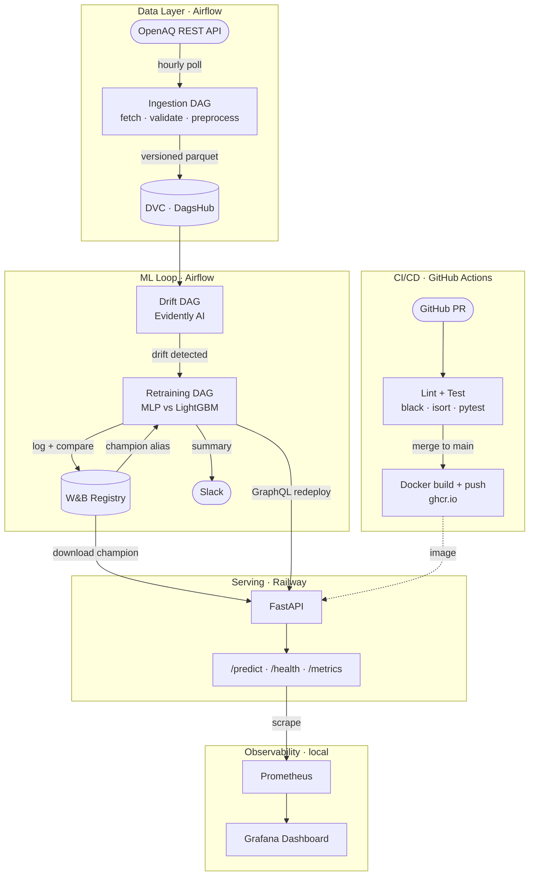

# AeroCast

> Production-grade, self-healing ML pipeline for hourly Air Quality Index (AQI) forecasting.

[](https://github.com/sagnik-t/Aerocast/actions/workflows/ci.yml)
[](https://github.com/sagnik-t/Aerocast/actions/workflows/docker.yml)

### 🌐 [sagnik-t.github.io/Aerocast](https://sagnik-t.github.io/Aerocast/) — Live Demo

**Live API** · [aerocast-production.up.railway.app](https://aerocast-production.up.railway.app/docs) &nbsp;|&nbsp;
**W&B Project** · [wandb.ai/sagnik-tr/aerocast](https://wandb.ai/sagnik-tr/aerocast) &nbsp;|&nbsp;
**Data Quality Report** · [GitHub Pages](https://sagnik-t.github.io/Aerocast/reports/baseline_data_quality.html) &nbsp;|&nbsp;
**Drift Report** · [GitHub Pages](https://sagnik-t.github.io/Aerocast/reports/baseline_drift.html)

---

## What is this?

AeroCast is an end-to-end MLOps capstone that forecasts AQI one hour ahead using real sensor data from the [OpenAQ REST API](https://docs.openaq.org/). The goal was to build the full production pattern — automated ingestion, data validation, experiment tracking, drift detection, retraining, and continuous deployment — not to chase a state-of-the-art model.

Two models compete on every training run: a **PyTorch Lightning MLP** and a **LightGBM sklearn Pipeline**. Weights & Biases tracks both, and the lower-RMSE model is automatically promoted to `champion` and deployed. If sensor data drifts beyond a configurable threshold, Airflow triggers a full retrain-and-redeploy cycle without human intervention.

---

## Architecture



---

## How the pipeline works

**1 · Ingestion** — The Airflow `ingestion_dag` runs hourly. It fetches measurements from configured OpenAQ sensor locations, validates the raw data with Great Expectations, preprocesses into model-ready features, and versions the result with DVC to DagsHub.

**2 · Drift detection** — The `drift_dag` runs after each successful ingestion. It computes dataset drift between the stored reference distribution and the latest batch using Evidently AI. If more than 50% of feature columns drift (configurable via `AEROCAST_DRIFT_DATASET_THRESHOLD`), the retraining DAG is triggered. HTML drift reports are written to `reports/drift/`.

**3 · Retraining** — The `retraining_dag` trains both the MLP and LightGBM models on the current processed data, logs all runs and artifacts to W&B, then compares validation RMSE. The winner receives the `champion` alias in the W&B registry; the runner-up receives `challenger`. After promotion, the DAG calls the Railway GraphQL API to trigger a live redeploy, then posts a summary to Slack.

**4 · Serving** — The FastAPI container on Railway downloads the `champion` artifact from W&B at startup. It exposes `POST /predict` (accepts any subset of feature columns, returns `{aqi, model_kind}`), `GET /health`, `GET /ready`, and `GET /metrics` (Prometheus format). The serving layer is model-agnostic — it deserialises MLP checkpoints and LightGBM pickles based on artifact metadata.

**5 · Observability** — Prometheus scrapes `/metrics` every 15 seconds. A pre-built Grafana dashboard visualises request rate, prediction latency (p50/p95/p99), total predictions by model kind, and service uptime.

---

## Design decisions

**Airflow, not Prefect or Luigi** — Airflow's DAG-as-code model makes the pipeline fully auditable and reproducible. The UI gives a visual history of every run, retry, and failure without any extra instrumentation.

**Pandas, not Spark or Polars** — Hourly REST API data volumes don't justify a distributed compute framework. Pandas keeps the preprocessing code readable and compatible with Great Expectations and scikit-learn. Swapping to PySpark would be a one-line change to the ingestion step.

**No Kafka** — AQI data arrives at most once per hour per sensor. A scheduled REST poll matches the actual data cadence; a streaming bus would add operational complexity with no benefit.

**CI/CD split between GitHub Actions and Airflow** — GitHub Actions owns code quality: linting, tests, and Docker image builds on every push. Model promotion is owned by Airflow because it requires runtime data context (drift metrics, validation scores) that a static CI pipeline can't have.

**Single W&B registry entry** — Both the MLP and LightGBM are logged under the same registry name (`aerocast-aqi-forecaster`). The model kind is stored as artifact metadata. The serving layer reads the metadata to choose the right deserialisation path, so the API never needs to know in advance which model type is champion.

**DVC → DagsHub, not S3** — DagsHub provides free Git + DVC hosting with a data versioning UI out of the box. For a project of this scale it removes the need to manage cloud storage credentials and bucket policies.

---

## Stack

| Layer | Technology |
|---|---|
| Orchestration | Apache Airflow 2.11 (Docker, LocalExecutor) |
| Data source | OpenAQ REST API v3 |
| Data versioning | DVC → DagsHub |
| Validation | Great Expectations 0.18 |
| Models | PyTorch Lightning MLP · LightGBM sklearn Pipeline |
| Experiment tracking | Weights & Biases |
| Drift detection | Evidently AI |
| Serving | FastAPI · Uvicorn · Docker |
| Deployment | Railway |
| CI/CD | GitHub Actions |
| Monitoring | Prometheus · Grafana |
| Alerting | Slack webhook |

---

## Quickstart

**Prerequisites:** Docker, Python 3.12, a `.env` file (see `.env.example`).

```bash
# 1. Clone and install
git clone git@github.com:sagnik-t/Aerocast.git
cd Aerocast
python -m venv .venv && source .venv/bin/activate
pip install -e ".[dev]"

# 2. Configure
cp .env.example .env
# Fill in OPENAQ_API_KEY, WANDB_API_KEY, WANDB_ENTITY, WANDB_PROJECT

# 3. Train a baseline model
CUDA_VISIBLE_DEVICES="" PYTHONPATH=src python -m aerocast.models.train --synthetic

# 4. Start the full local stack (API + Prometheus + Grafana)
docker compose up --build

# 5. Smoke test
BASE_URL=http://localhost:8000 python scripts/smoke_test.py
```

To start the Airflow stack:

```bash
cd airflow && docker compose up --build
# UI at http://localhost:8080 — enable the three DAGs to start the pipeline
```

---

## Reports

Generated with Evidently AI and served via GitHub Pages:

- [Baseline data quality report](https://sagnik-t.github.io/Aerocast/reports/baseline_data_quality.html)
- [Baseline drift report](https://sagnik-t.github.io/Aerocast/reports/baseline_drift.html)

Live drift reports are written to `reports/drift/drift_<timestamp>.html` on each pipeline run.

---

## Limitations

The Airflow stack runs locally in Docker Compose. For the pipeline to self-heal continuously, it would need to be hosted on a cloud VM or a managed Airflow service (Astronomer, AWS MWAA, Cloud Composer). The current setup is a complete, runnable demonstration of the MLOps pattern.
